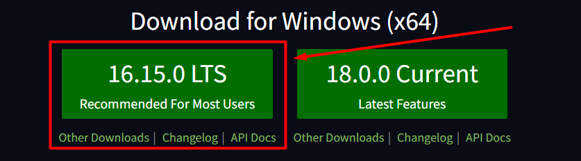

# telnyx-playwright-ts
This is TypeScript Playwright automation tests created to test some functionality 
of the [Telnyx](https://telnyx.com/) website.

Test cases for this project you can find here: 
https://trello.com/b/TlpWq0QT/telnyx-playwright-testcases

## Project installation
You need to install a Node.js LTS:
Using this reference: https://nodejs.org/en/

Then, you can download the project.
Click the "code" button. You can download ZIP archive on your PC, or instead use the `git clone`
command in Command Prompt.

After that open the command prompt in the project folder and run the
`npm install`, and then execute the `npm init playwright@latest` command.

To get more info about Playwright you can use this link:
https://playwright.dev/docs/intro

## How to start your tests
To run the tests you can use the `npx playwright test` command. Please, be sure that
your npx is installed. It can be pre-installed with npm > v.5.2 or installed separately.

To get more variants to start your cypress tests or more information about cypress
visit this page: https://playwright.dev/docs/intro
